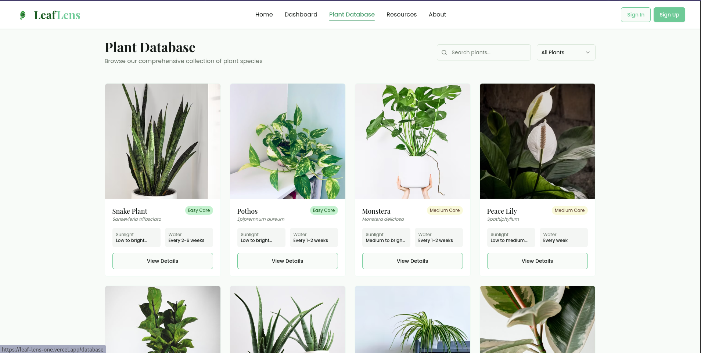

# 🌿 LeafLens: Plant Identification & Care Guide

## 🌱 Project Overview

LeafLens is an AI-powered plant identification application that helps users identify plants through image uploads or text descriptions, providing detailed care information and growing tips.

**🔗 Live Demo**: [View LeafLens App](https://leaf-lens-one.vercel.app/)

<!-- You can add a banner image of your app here -->

## ✨ Features

- 📸 **Image-based Plant Identification**: Upload photos of plants for instant identification
- 📝 **Text-based Identification**: Describe plants to get accurate identification results
- 🖼️ **Visual Results**: See your uploaded plant image displayed with identification results
- 🌍 **Comprehensive Plant Database**: Access information on 20+ common plants
- 💧 **Detailed Care Instructions**: Get watering, light, and temperature requirements
- 🔍 **Scientific Information**: View both common and scientific names with confidence levels
- 📊 **Standardized Results Format**: Consistent, detailed plant information display
- 📱 **Mobile Responsive**: Fully optimized for all devices with camera integration
- 🔐 **User Authentication**: Secure login with Clerk authentication

## 🚀 Getting Started

### Prerequisites

- Node.js & npm - [install with nvm](https://github.com/nvm-sh/nvm#installing-and-updating)
- Git

### Installation

```sh
# Clone the repository
git clone https://github.com/midlaj-muhammed/LeafLens.git

# Navigate to project directory
cd leaf-whisper-garden-guide-main

# Install dependencies
npm install

# Create .env.local file and add your Clerk publishable key
echo "VITE_CLERK_PUBLISHABLE_KEY=your_clerk_publishable_key_here" > .env.local

# Start the development server
npm run dev
```

## 🛠️ Development Options

### 1️⃣ Use Lovable Platform

Simply visit the [LeafLens Project](https://lovable.dev/projects/dead4720-b7aa-439c-a42a-8770a3287f0c) and start prompting.
Changes made via Lovable will be committed automatically to this repo.

### 2️⃣ Use Your Preferred IDE

Work locally using your own IDE by cloning this repo and pushing changes.
Pushed changes will also be reflected in Lovable.

### 3️⃣ Edit Directly in GitHub

- Navigate to the desired file(s)
- Click the "Edit" button (pencil icon) at the top right
- Make your changes and commit

### 4️⃣ Use GitHub Codespaces

- Navigate to the main repository page
- Click on the "Code" button (green button) near the top right
- Select the "Codespaces" tab
- Click on "New codespace" to launch a new environment
- Edit files directly within the Codespace

## 🧰 Technology Stack

This project leverages modern web technologies:

- ⚡ **Vite**: Next-generation frontend tooling
- 📘 **TypeScript**: Type-safe JavaScript
- ⚛️ **React**: UI component library
- 🎨 **Tailwind CSS**: Utility-first CSS framework
- 🧩 **shadcn/ui**: Reusable component system
- 🔑 **Clerk**: Authentication and user management
- 🤖 **Google Gemini API**: AI-powered plant identification

## 🌟 Key Features in Detail

### 📊 Standardized Plant Identification Results

When you identify a plant using LeafLens, you'll receive comprehensive information in a consistent format:

- 🔍 **Scientific & Common Names**: Full botanical identification
- 🧠 **Confidence Level**: AI certainty percentage
- 🌎 **Native Region**: Geographic origin information
- 🌱 **Common Uses**: Practical applications of the plant
- ☀️ **Light Requirements**: Optimal sunlight conditions
- 💧 **Watering Needs**: Frequency and watering tips
- 🌡️ **Temperature Range**: Ideal climate conditions
- 🧪 **Additional Care Tips**: Expert growing advice

### 🖼️ Visual Plant Recognition

- When you upload a plant image, it's displayed at the top of your identification results
- For text-based identification, a decorative plant icon is shown instead
- All results maintain the same comprehensive information format

## 📦 Deployment

Simply open [Lovable](https://lovable.dev/projects/dead4720-b7aa-439c-a42a-8770a3287f0c) and click on Share -> Publish.

## 🔗 Custom Domain

Yes, you can connect your own domain!

To connect a domain, navigate to Project > Settings > Domains and click Connect Domain.

Read more here: [Setting up a custom domain](https://docs.lovable.dev/tips-tricks/custom-domain#step-by-step-guide)

## 📸 Screenshots





## 📄 License

This project is licensed under the MIT License - see the LICENSE file for details.

## 🙏 Acknowledgments

- Plant data and images from various botanical resources
- Icons from [Lucide Icons](https://lucide.dev/)
- AI-powered identification by Google Gemini API

